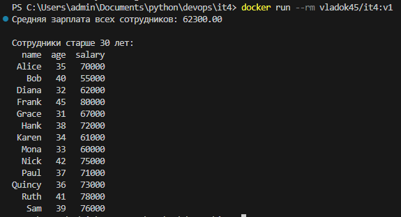

**Задание 4.** 

**Создание Docker-контейнера с Pandas**

**Цель: Научиться создавать Docker-контейнер с Python-приложением, которое выполняет анализ данных с использованием библиотеки Pandas. В этом приложении будет произведен расчет средней зарплаты и выборка сотрудников старше 30 лет.**

Описание задания:

- Создайте директорию для проекта и необходимые файлы.
- Создайте файл data.csv с примерными данными о сотрудниках. Убедитесь, что в файле не менее 20 строк.
- В файле app.py создайте Python-скрипт, который будет:
1. Загружать данные из data.csv.
1. Вычислять среднюю зарплату всех сотрудников.
1. Отбирать и выводить только тех сотрудников, которым больше 30 лет.
- Создайте Dockerfile для сборки образа вашего Python-приложения, использующего Pandas.
- После запуска контейнера вы должны увидеть в терминале вывод с:
1. Средней зарплатой всех сотрудников.
1. Списком сотрудников, которым больше 30 лет.

Скрипт на Python для анализа данных:

########### **it4\_app.py**  ######################

import pandas as pd

\# Загружаем данные из файла data.csv

data = pd.read\_csv('data.csv')

\# Вычисляем среднюю зарплату

average\_salary = data['salary'].mean()

\# Отбираем сотрудников старше 30 лет

employees\_over\_30 = data[data['age'] > 30]

\# Выводим результаты

print(f"Средняя зарплата всех сотрудников: {average\_salary:.2f}")

print("\nСотрудники старше 30 лет:")

print(employees\_over\_30.to\_string(index=False))

###############################################

############### **Dockerfile** ####################

\# Используем базовый образ Python

FROM python:3.12-slim

\# Устанавливаем pandas

RUN pip install pandas

\# Устанавливаем рабочую директорию

WORKDIR /app

\# Копируем файлы проекта в контейнер

COPY it4\_app.py it4\_app.py

COPY data.csv data.csv

\# Определяем команду для запуска приложения

CMD ["python", "it4\_app.py"]

#############################################

**## Сборка и запуск контейнера**

docker build -t vladok45/it4:v1 .

docker run --rm vladok45/it4:v1

